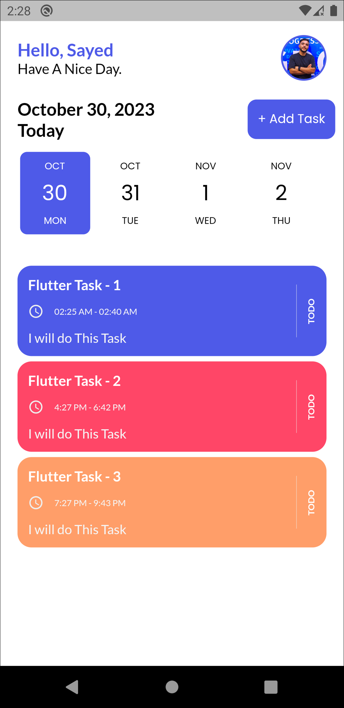
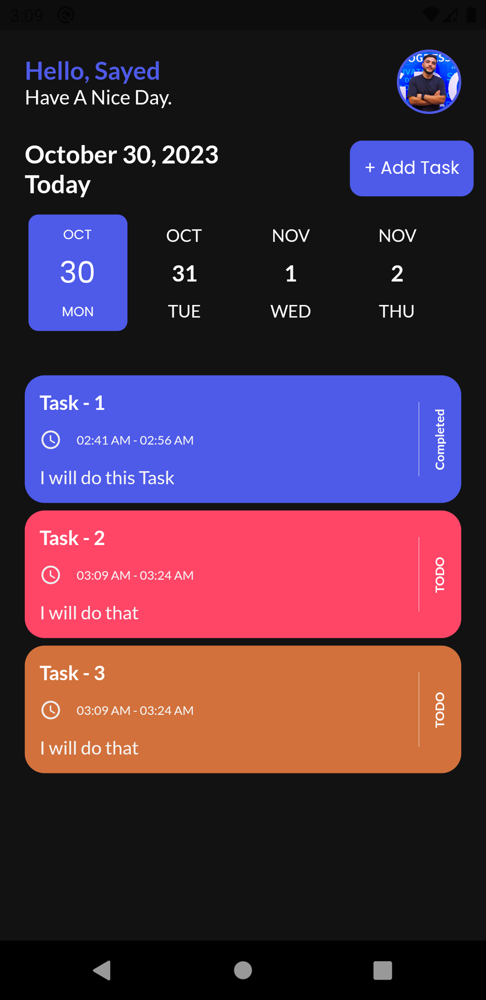

# 📝 Tasks App

A simple and elegant task management mobile application built with **Flutter**.  
The app allows users to create, edit, and manage their daily tasks with a clean UI and a **Dark Mode** option for better user experience.

---

## 🚀 Features
- ✅ Add, edit, and delete tasks  
- 👤 Profile section with **user account name & profile picture**  
- 🌗 **Dark Mode** & Light Mode support  
- 🎯 Simple, clean, and modern design  

---

## 📸 Screenshots

| Light Mode | Dark Mode |
|------------|-----------|
|  |  |

---

## 🛠️ Tech Stack
- **Flutter & Dart** – UI & Logic  
- **Hive / Firebase** – Local & Cloud Storage  
- **Cubit / Provider** – State Management  

---

## 📂 Project Structure
